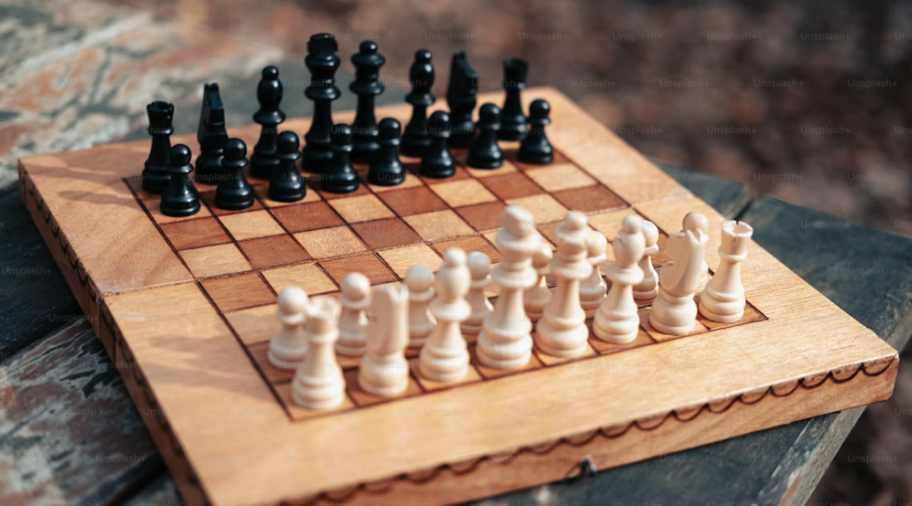

# learning-chess

Welcome to the **learning-chess** repository! This project serves as a digital storehouse for my journey to improve at chess, combining my passion for open-source development with my love of the game. Here, you'll find a detailed account of my chess training, organized by the materials I use, and insights gained from the process.

## Motivation

The motivation behind this repository is to document and share my chess improvement journey in a structured way. By creating a digital archive of my learning process, I aim to:

- **Combine Development and Chess**: Merge my interests in open-source development and chess into a cohesive project.
- **Track Progress**: Log my training, the puzzles I solve, and the tips I learn from various resources.
- **Organize Resources**: Separate my training by the specific materials I use, whether they be books, chess apps, or in-person games.
- **Share Learnings**: Offer insights and tips gained from books, videos, and other resources.
- **Curate Famous Games**: Develop a curated archive of famous chess games, documenting the lessons I've learned from them.
- **Utilize Open-Source Tools**: Leverage [Lichess](https://lichess.org/) and other open-source chess apps to digitize games, puzzles, and analyses.

## Tools & Resources

This repository will heavily utilize open-source tools and platforms, including:

- **Lichess**: For digitizing and analyzing games and puzzles.
- **YouTube Videos**: ... _sources to be added_ ...
- **Twitch**: ... _sources to be added_ ...
- **Chess Apps**: To assist in training and game analysis (e.g., [Chess Time](https://apps.apple.com/us/app/chess-time-multiplayer-chess/id455602152), [Chess.com](https://www.chess.com/play/apps))

Stay tuned for updates as I continue to add content and refine my learning process!

---

<strong>Let's Play Chess!</strong>

